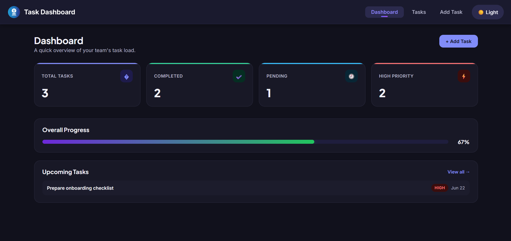
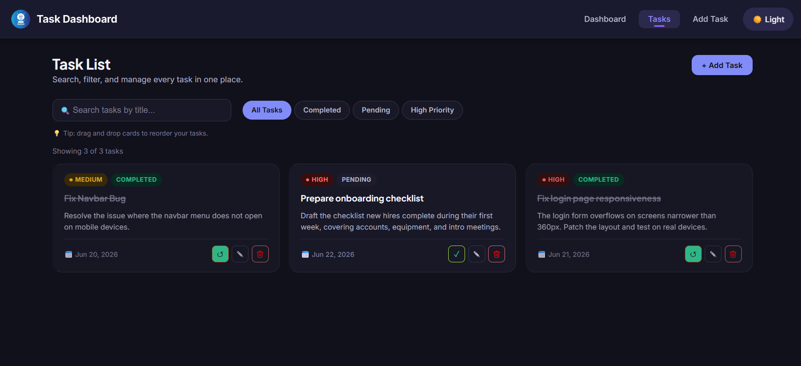
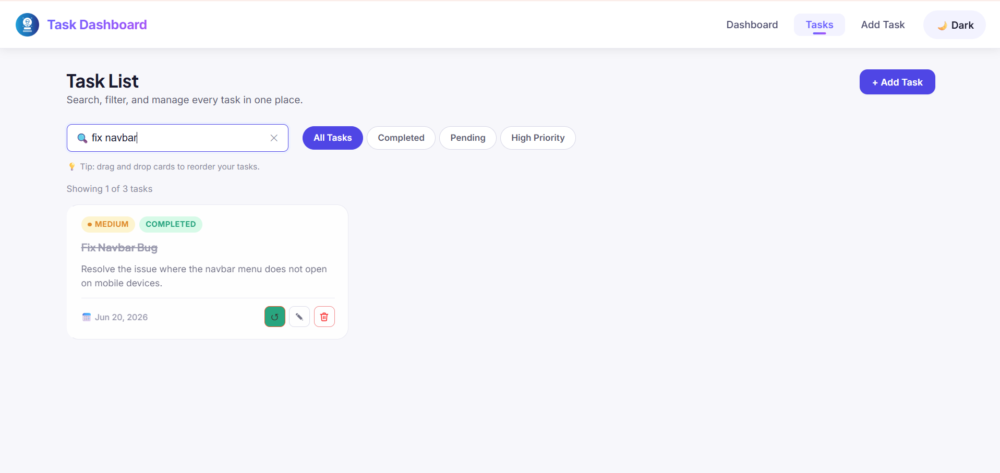
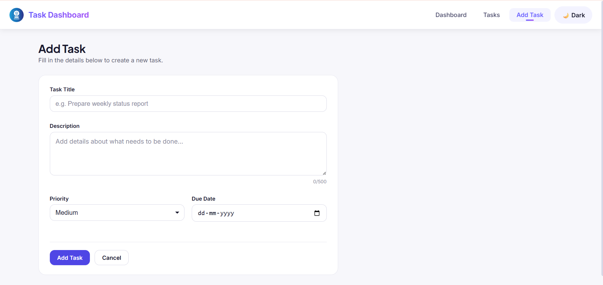
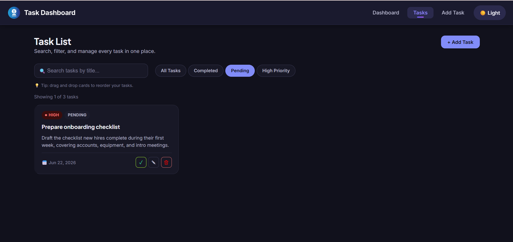
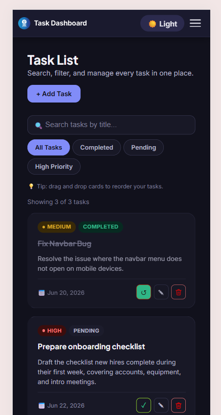

# Employee Task Dashboard

A production-ready task management dashboard built with **React + Vite**. Employees can create, organize, filter, and track tasks with a clean, responsive UI that works on mobile, tablet, and desktop. All data is persisted to `localStorage`, so tasks survive page refreshes with no backend required.

## Live Demo

https://employee-task-dashboard-eight.vercel.app


---

## Features

- **Dashboard** — at-a-glance stat cards (Total / Completed / Pending / High Priority), an overall completion progress bar, and an "Upcoming Tasks" preview.
- **Full Task CRUD** — add, view, edit, delete, and mark tasks complete/incomplete.
- **Validated Add/Edit Form** — required-field validation with inline error messages; submission is blocked until the form is valid.
- **Search + Filter** — search by title and filter by status/priority simultaneously.
- **Drag & Drop** — reorder tasks directly in the Task List.
- **Dark Mode** — toggle in the navbar, preference persisted across sessions.
- **Toast Notifications** — confirmation feedback for add/update/delete actions.
- **Responsive UI** — adaptive grid layouts and a collapsible mobile nav.
- **Resilient by design** — an Error Boundary catches render crashes, and `localStorage` reads/writes are wrapped in try/catch so corrupted storage can't break the app.

## Tech Stack

| Layer             | Choice                                         |
|-------------------|----------------------------------------------- |
| UI                | React 18 (functional components + hooks)       |
| Build tool        | Vite 8                                         |
| Routing           | React Router DOM 6                             |
| State management  | Context API (`TaskContext`)                    |
| Persistence       | Browser `localStorage`                         |
| Styling           | Plain modern CSS (CSS variables, no framework) |

##  Project Structure

```
employee-task-dashboard/
├── index.html
├── package.json
├── vite.config.js
├── public/
│   └── employee.png
└── src/
    ├── main.jsx                 # App entry point
    ├── App.jsx                  # Router + layout shell
    ├── index.css                # Design tokens, resets, shared utilities
    ├── components/
    │   ├── Navbar.jsx / .css    # Top navigation + dark mode toggle
    │   ├── TaskCard.jsx         # Single task card (badges, actions, drag handlers)
    │   ├── TaskForm.jsx         # Shared Add/Edit form with validation
    │   ├── ConfirmModal.jsx     # Reusable delete confirmation dialog
    │   ├── SearchFilter.jsx     # Search box + filter chips
    │   ├── Toast.jsx / .css     # Toast notification stack
    │   └── ErrorBoundary.jsx    # Catches render errors app-wide
    ├── pages/
    │   ├── Dashboard.jsx        # "/"
    │   ├── TaskList.jsx         # "/tasks"
    │   ├── AddTask.jsx          # "/add-task"
    │   ├── EditTask.jsx         # "/edit-task/:id"
    │   └── NotFound.jsx         # catch-all route
    ├── context/
    │   └── TaskContext.jsx      # Global state, CRUD logic, localStorage sync
    └── styles/
        ├── dashboard.css        # Stat cards, progress bar
        ├── task.css             # Task grid, cards, badges, search/filter bar
        └── form.css             # Form fields & layout
```

## Getting Started

### Prerequisites
- [Node.js](https://nodejs.org/) v18 or later
- npm (bundled with Node)

### Installation & Run

```bash
# 1. Install dependencies
npm install

# 2. Start the dev server
npm run dev
```

The app will be available at **http://localhost:5173**.

### Other scripts

```bash
npm run build     # Production build → dist/
npm run preview   # Preview the production build locally
npm run lint       # Run ESLint
```

##  Routes

| Path                | Page         | Description                          |
|----------------------|--------------|---------------------------------------|
| `/`                  | Dashboard    | Stats overview + upcoming tasks       |
| `/tasks`             | Task List    | Browse, search, filter, reorder tasks |
| `/add-task`          | Add Task     | Create a new task                     |
| `/edit-task/:id`     | Edit Task    | Update an existing task               |
| any other path       | Not Found    | Friendly 404 page                     |

##  Task Data Model

```js
{
  id: 'task-1718...',        // generated unique id
  title: 'Fix Navbar Bug',
  description: 'Resolve the issue where the navbar menu does not open on mobile devices.',
  priority: 'High' | 'Medium' | 'Low',
  status: 'Pending' | 'Completed',
  dueDate: '2026-06-20',      // ISO date string (YYYY-MM-DD)
}
```

## How persistence works

`TaskContext` keeps `tasks` and `theme` in React state, and a `useEffect` writes them to `localStorage` (`etd_tasks` and `etd_theme` keys) on every change. On load, the app reads from `localStorage` first; if nothing is there yet, it seeds a few sample tasks so the dashboard isn't empty on a fresh install. All read/write operations are wrapped in `try/catch` so a corrupted or full storage quota degrades gracefully instead of crashing the app.

## Design notes

The UI uses a focused indigo/slate palette with a warm amber accent reserved for priority and attention cues, set in Plus Jakarta Sans (display) and Inter (body). All colors, spacing, and radii are defined as CSS custom properties in `src/index.css`, and dark mode simply swaps the variable values via a `data-theme="dark"` attribute on `<html>` — no separate dark stylesheet to maintain.

## Engineering Decisions

A few choices made deliberately, in case they come up during review:

- **Why Context API instead of Redux/Zustand** — the app has one shape of shared state (tasks + theme + toasts) with no deeply nested updates or cross-slice dependencies. Context + a single custom hook (`useTasks()`) keeps the data flow obvious without pulling in a state library the project doesn't need.
- **Why one shared `TaskForm` for both Add and Edit** — Add and Edit have identical fields and identical validation rules; the only difference is pre-filled values and the submit handler. Duplicating the form would mean fixing every validation bug twice.
- **Why localStorage writes are wrapped in try/catch** — private/incognito browsing and full storage quotas can make `localStorage.setItem` throw. Without the guard, a single failed write would crash the whole app instead of just showing a toast.
- **Why delete requires a second click instead of `window.confirm`** — native browser confirm dialogs break the visual flow and can't be styled or tested the same way as the rest of the UI. The button re-arms itself after 3 seconds if not confirmed.
- **Why dark mode is one stylesheet, not two** — every color is a CSS variable; dark mode just swaps the variable values via a `data-theme` attribute. No separate dark CSS file to keep in sync as the app grows.

##  Known limitations

Being upfront about trade-offs is part of writing honest documentation:

- Data is local to one browser — there's no backend, so tasks won't sync across devices.
- Drag-and-drop uses the native HTML5 API rather than a library; it's solid on desktop but touch-drag on mobile is intentionally out of scope for this assessment.
- No automated test suite is included; the project was verified with the manual QA checklist below instead, given the assessment's time constraints.


- **Dark Mode** — implemented via CSS variables + a `data-theme` attribute, toggled from the navbar, persisted to `localStorage`.
- **Context API** — `TaskContext` is the single source of truth for tasks, theme, and toasts; consumed via the `useTasks()` hook.
- **Toast Notifications** — a lightweight in-context queue (no extra dependency), auto-dismissing after ~3 seconds.
- **Drag and Drop** — implemented with the native HTML5 Drag and Drop API directly on `TaskCard`, reordering the underlying array in context (and therefore in `localStorage`).
- **Sample data on first run** — the app seeds a small set of realistic sample tasks the very first time it runs (empty storage), similar in spirit to pulling starter data from an API like JSONPlaceholder, reshaped to this app's task schema.

##  Manual QA checklist

- [x] Add a task with all fields valid → appears in Task List and updates Dashboard stats
- [x] Submit the Add Task form with empty fields → inline errors shown, submission blocked
- [x] Edit an existing task → changes persist after refresh
- [x] Delete a task (two-click confirm) → removed from list and storage
- [x] Mark a task complete/incomplete → stats and badges update immediately
- [x] Search + filter together → results narrow correctly
- [x] Drag and drop two cards → order persists after refresh
- [x] Toggle dark mode → persists after refresh
- [x] Resize to mobile width → nav collapses, cards stack, forms remain usable
- [x] Navigate to `/edit-task/does-not-exist` → friendly "not found" state, no crash


## Screenshots

### Dashboard


### Task List


### Search by Title


### Add Task Form


### Filter Tasks


### Mobile Responsive View


## License

This project was created for an internship technical assessment and is free to use for learning purposes.
